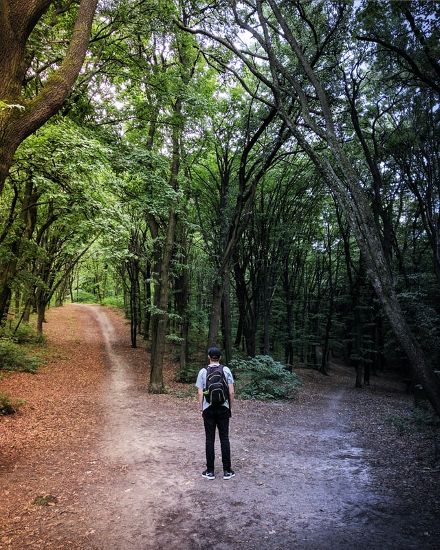

In 'The Hitchhiker's guide to the Galaxy', a philosopher (Vroomfondel) argues
that the quest for the ultimate truth is not suitable for computers and wants
policy for it:

> We demand Rigidly defined areas of doubt and uncertainty

And although I am fairly certain that Douglas Adams just really loved the play
with words: Rigidly defined vs uncertainty, this does not prevent 
[project managers in IT](https://www.itworldcanada.com/article/define-doubt-uncertainty-for-best-project-results/12473), or  [stockbrokers](https://cabotwealth.com/?button=rigidly-defined-areas-uncertainty-doubt)
to use this quote in wholly inapplicable ways. But who am I to judge them, I 
will do the same thing.

I talked to a friend yesterday how policy has become polarized (wearing a mask,
sending children to school or not). Your position becomes part of your identity
or your identity forces you into a position. Are we afraid to of uncertainty?
Are we unable to say: "There is not enough information"? 

I think there are areas of certainty:

- Earth is a potato like globe, roundish, absolutely not flat.
- Smoking is really really bad for you.
- Climate change is happening, and we are responsible for it.

And maybe we DO need to rigidly define the areas of doubt and uncertainty:

- Most food is not super bad or good  for you, no specific food causes or prevents
cancer, but the effect of diet is just uncertain.
- We are uncertain about the effects of non-medical masks on sars-covid-2 transmission.

So let's practice for when someone wants to know something that is uncertain 
and say it with me:

> We (currently) do not know

*I’m publishing this as part of 100 Days To Offload. You can join in yourself by visiting https://100daystooffload.com, post - 24/100*

*Find other posts tagged  [#100DaysToOffload here](https://notes.rmhogervorst.nl/tags/100DaysToOffload/)*

Photo by <a href="https://unsplash.com/@garri?utm_source=unsplash&amp;utm_medium=referral&amp;utm_content=creditCopyText">Vladislav Babienko</a> on <a href="https://unsplash.com/?utm_source=unsplash&amp;utm_medium=referral&amp;utm_content=creditCopyText">Unsplash</a>
