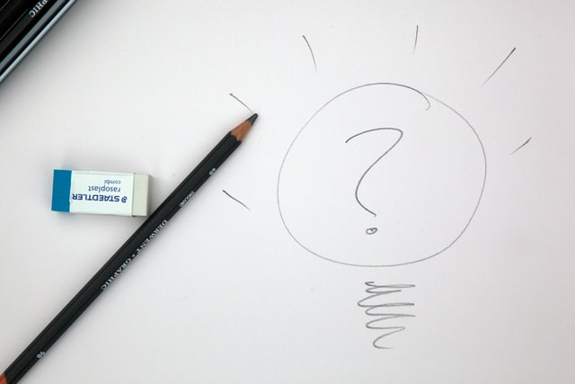

I am a bit confused about the strategy of the Dutch Government concerning
COVID19. Let me preface this with: I am not a specialist, I do not have answers
and I will definately not tell others how to do their job. I think the RIVM (
Institute for health and environment) and the GGDs (Regional health services)
are doing a great job. I wouldn't know how to judge them, and so I will not. 

I'm seeing news messages that the number of confirmed COVID19 cases is going up
again. 

> Spread throughout the country, there is an increase in the number of small local outbreaks (clusters) of three or more related infections. There are currently 133 active COVID-19 clusters in the Netherlands. The average size of these clusters is 5.9 people (range: 3-23). Most infections still take place within the home. The number of infection clusters due to contact with other family members, friends, at parties, in the workplace or other leisure activities is increasing.

But I'm not seeing any corresponding measures. [The number of cases rises again](https://www.rivm.nl/node/160411 "english version"). This leads me
to two things I do not understand:

Looking at the graphs the number of cases was very low in the start of July (July 6th), why
didn't we continue with strict measures until the number was close to zero?
If there are less cases, any doubling would have a lower effect and it is way
easier to trace the contacts again. 

The second thing I don't get, is why there are no extra measures in effect in
reaction to the rising numbers. Or a regional lockdown, it is clear the most
cases are in Zuid Holland. It's almost like a reverse gas price to oil price 
reaction: if the oil prices go up, gas goes up immediately, but if the oil prices
go down, for some reason it takes a while for the gas prices to go down. 
Similarly it seems that when the number of confirmed COVID19 cases went down
the lockdown measures went less strict quickly, but not when it flairs up in 
the other direction?

So what is the strategy?



The Dutch government says itself:

```
De Nederlandse corona-aanpak is erop gericht het virus maximaal onder controle te houden, de zorg niet te overbelasten en kwetsbare mensen in de samenleving te beschermen.
```
Which roughly translates to:

> Our goal is to maximise control over the virus, make sure healthcare is not 
overwhelmed and to protect vulnerable people in society. 

Other things that are going on now:

- This is a vacation period, many people are on holidays
- The prime minister is on holiday too
- This is the prime time for bars, hotels and restaurants to make money

I guess closing down visits to bars and restaurants would be the first move
to reduce transmissions of COVID19. So are we:

- unwilling to compensate entrepeneurs and others in these industries?
- letting COVID19 flare up until the hospitals are at capacity?
- unable to make any decisions until the prime minister is back?
- unwilling to deal with virus deniers?

Or is it something else?
Looking at the english report from last week (there will be a new one today):

> In addition to an increase in the number of infections, there is also a shift in age structure. In recent weeks, we have seen a stronger increase among younger age groups than among older age groups. 

So it is mostly in younger people (20-29 & 30-39 years old) that cases have increased. Well, that is not entirely true, it is happening in the 50-59 
bracket too. So it is not just young people partying. 

So what is the strategy here? I don't know, the future might tell us more. 


*I’m publishing this as part of 100 Days To Offload. You can join in yourself by visiting https://100daystooffload.com, post - 29/100*

*Find other posts tagged  [#100DaysToOffload here](https://notes.rmhogervorst.nl/tags/100DaysToOffload/)*

<span>Photo by <a href="https://unsplash.com/@boab?utm_source=unsplash&amp;utm_medium=referral&amp;utm_content=creditCopyText">Mark Fletcher-Brown</a> on <a href="https://unsplash.com/s/photos/strategy?utm_source=unsplash&amp;utm_medium=referral&amp;utm_content=creditCopyText">Unsplash</a></span>
