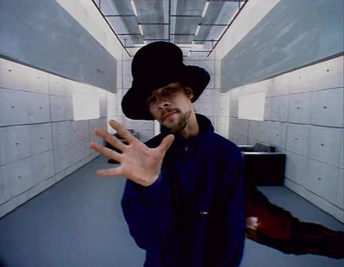

'Virtual Insanity' by Jamiroquai came out in [1997](https://notes.rmhogervorst.nl/tags/1997) 
and I still play it a lot. I think the song describes over-consumption, environmental
damage and a fear that many people have of our 'addiction' to technology.



Let's break down some parts of the song and see what the Stoics would say about
it.

## Chorus
The chorus is
```
Future's made of virtual insanity, now
Always seem to be governed by this love we have
For useless, twisting, all that new technology
Oh, now there is no sound, for we all live underground
```

This describes the 'tuphos', the mist, the great illusion that mankind suffers 
from: 

> The idea that superficial things are good or bad

But they are not.

We seem to long for new things, almost an insanity for new things/ gadgets.
I would not go as far as saying that all of it is useless, but clearly not 
important. 


## The first verse

```
Yeah, it's a wonder man can eat at all
When things are big that should be small
Who can tell what magic spells we'll be doing for us
And I'm giving all my love to this world
Only to be told
I can't see
I can't breathe
No more will we be

And nothing's gonna change the way we live
'Cause we can always take, but never give
And, now that things are changing for the worse, see:
Whoa, it's a crazy world we're living in!
And I just can't see that half of us immersed in sin
Is all we have to give these
```

In the first verse Jay explains his love for the entire world, he seems to have 
compassion for the entire human cosmopolis, but he also 
seems to expect something back from the world? 

Dear Jay, it would be a preferred 
indifference if you get something back, but the world does not owe you anything.
We choose to do good, because that is the right thing to do, it is in 
accordance with our values. 

Of course Jay noticing that we collectively are destroying the world and some
of us trying to improve it, but others actively making it worse is correct. 
Maybe we should try to understand what makes people do this? Most people act
rationally in how they understand the world. So maybe their understanding of the
world needs to change? And in a way this song is one of the ways Jamiroquai is
influencing the world. 

In the bridge / seque of the song they explain that we have to change:

```
Of this virtual insanity, we're livin' in
Has got to change, yeah
Things, will never be the same
And I can't go on
While we're livin' in oh, oh virtual insanity
Oh, this world, has got to change
'Cause I just, I just can't keep going on, it was virtual
Virtual insanity that we're livin' in, that we're livin' in
That virtual insanity is what it is
Yeah
```

## So what should we do
Crucially, there is no path forwards. What should be changed? It is not enough
to say 'not this'. I get the frustration, I'm living it daily, maybe thanks to
this song! 

So what should we do? I don't know either Jay, but before we attack genetic 
modifications, and useless technology (like in this song), I think we should 
focus on fighting climate change. And in all our decisions strive to make them
while keeping in mind what is best (righteous) for the entire world. Will I buy
this cheap Chinese/Taiwanese/Vietnamese product that has to be shipped over 
the entire world or buy
this second hand version, or something that is created close by. 

Or maybe you 
should listen to Jamiruquai and realise you do not need it at all. 


*I am absolutely looking for more meaning in this song, than the authors intended. I want to practice a Stoic viewpoint and this is also lovely material.*

-[lyrics of virtual insanity - jamiroquai](https://www.metrolyrics.com/virtual-insanity-lyrics-jamiroquai.html)
- [genius explanation of people about this song](https://genius.com/Jamiroquai-virtual-insanity-lyrics)
*I’m publishing this as part of 100 Days To Offload. You can join in yourself by visiting https://100daystooffload.com, post - 30/100*

*Find other posts tagged  [#100DaysToOffload here](https://notes.rmhogervorst.nl/tags/100DaysToOffload/)*

Lazy Image credits:
- Jay in virtual insanity clip <https://leegiacopazzi.wordpress.com/tag/skeleton-boy/>
- picture daily mail <https://www.dailymail.co.uk/tvshowbiz/article-3378619/Jamiroquai-s-Jay-Kay-looks-miles-apart-former-self.html>
