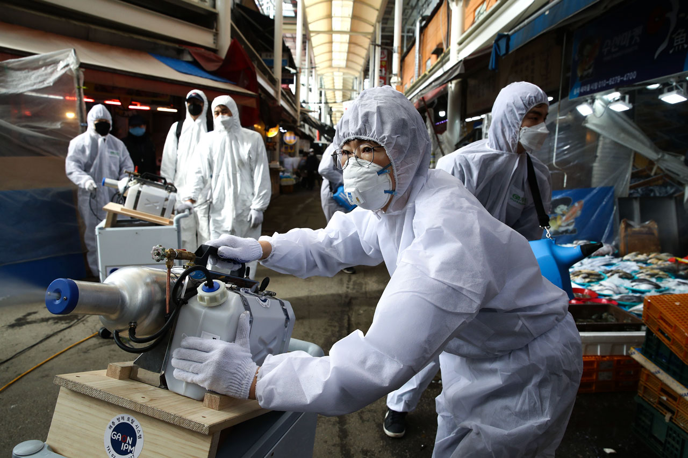

Today, see this: 

[Six Months of Pandemic Photography](https://blogs.sciencemag.org/vis/2020/07/02/six-months-of-pandemic-photography/)

Chilling images of pandemic so far. 

I will highlight this one

*26 FEBRUARY  As the number of confirmed cases rises, workers spray disinfectant solution at a traditional market in Seoul.*

I was in Seoul airport a few days later, very much unaware of the size of this pandemic. We called it the Wuhan virus, thinking it would not spread much. Boy were we wrong! 
