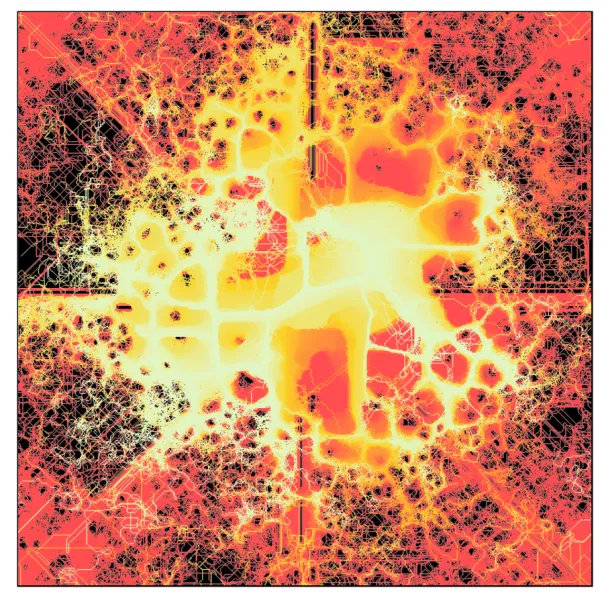

I don't know how, but I stumbled upon this [blogpost](https://fronkonstin.com/2020/08/11/abstractions/) by
Antonio Sánchez Chinchón ([@aschinchon on twitter](https://twitter.com/aschinchon)).

He is generating 'random' art by a generative process. It is using, as far as I understand it, a Conway game-of-life type of 
process where you start with a random initialization and the process
steps in time and in every step values change based on neighboring cells.

As he writes:

> a generative system called Physarum model, which simulates the evolution of a colony of extremely simple organisms that, under certain environmental conditions, result into complex behaviors.

And it is producing beautiful pictures like this one:

[The code to produce these things is here](https://github.com/aschinchon/abstractions). It is an R implementation based on a blogpost by Sage Jenson 
*based on a paper by [Jeff Jones](https://uwe-repository.worktribe.com/output/980579/characteristics-of-pattern-formation-and-evolution-in-approximations-of-physarum-transport-networks)*.

I love these generative pieces! It is such a beautiful process with
simple rules that deliver complex results!

Find other posts tagged  [inspiration](https://notes.rmhogervorst.nl/tags/inspiration/)
[generative_art](https://notes.rmhogervorst.nl/tags/generative_art/)
