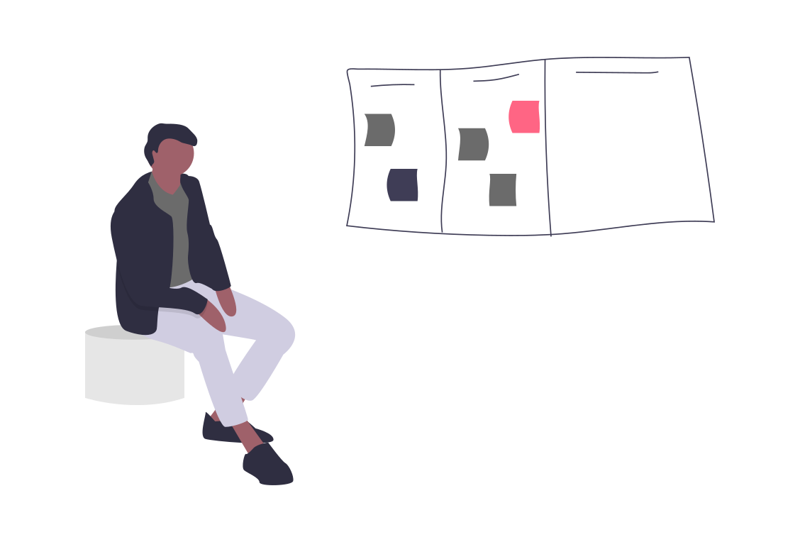

I was going through my zettelkasten/slipbox, finding orphaned notes, adding some links
and although I am happy with the method in general, I feel I'm not doing it
right. This is only natural, I think, because you teach yourself something new
and after some reflection you tune your methods. So what did I find?

Currently I have a lot of small deep paths, but they are barely 
connected to other places in my slipbox. I have a bad habit of collecting 
stuff without really deeply interacting with it (*the collectors fallacy?*). 
For example: I have 'useful models' (an index of, and small explanation of
'The great mental models' by Farnam Street). I also sometimes have long pieces
that should really be broken up into separate concepts.


In fact in June I wrote a note somewhere:

```
I've joined the 100daystooffload challenge, to write more
but most of my posts are very small. and feel empty to me.
I feel like I have run out of steam / juice. 
and most of the posts are based on single thing I've seen or heard, not
a development of my thinking. 

I also realise that I have been collecting, hoarding more articles. 
I feel like there is nothing to write, nothing to create. 
Is it work burning me up? 
Am I spending soo much time on reading and work that there is no energy left?

This is too bad, because I started a zettelkasten because I wanted it to give me 
power to write. building the connections would create interesting ideas. 
Maybe the zettelkasten is the problem.… I have been adding rather low quality 
dumps to it in stead of cross connecting. Maybe I should dive in more.

The posts all begin with empty page and an idea, but ideally it should start 
from investigating your second brain. 
A good workflow that follows your interests carries you forward, 
it creates an intrinsic motivation that keeps you going. 
```



Maybe I'm not taking the time to peruse my collection? 
Todays curation was actually quite enjoyable, not at all like my experience 
before I had this system. It s quite nice to go through my zettels, 
connecting some, making notes for new concepts, and adding new concepts.


*I'm publishing this as part of 100 Days To Offload. You can join in yourself by visiting <https://100daystooffload.com>, post - 32/100*

*Find other posts tagged [\#100DaysToOffload here](https://notes.rmhogervorst.nl/tags/100DaysToOffload/)*
