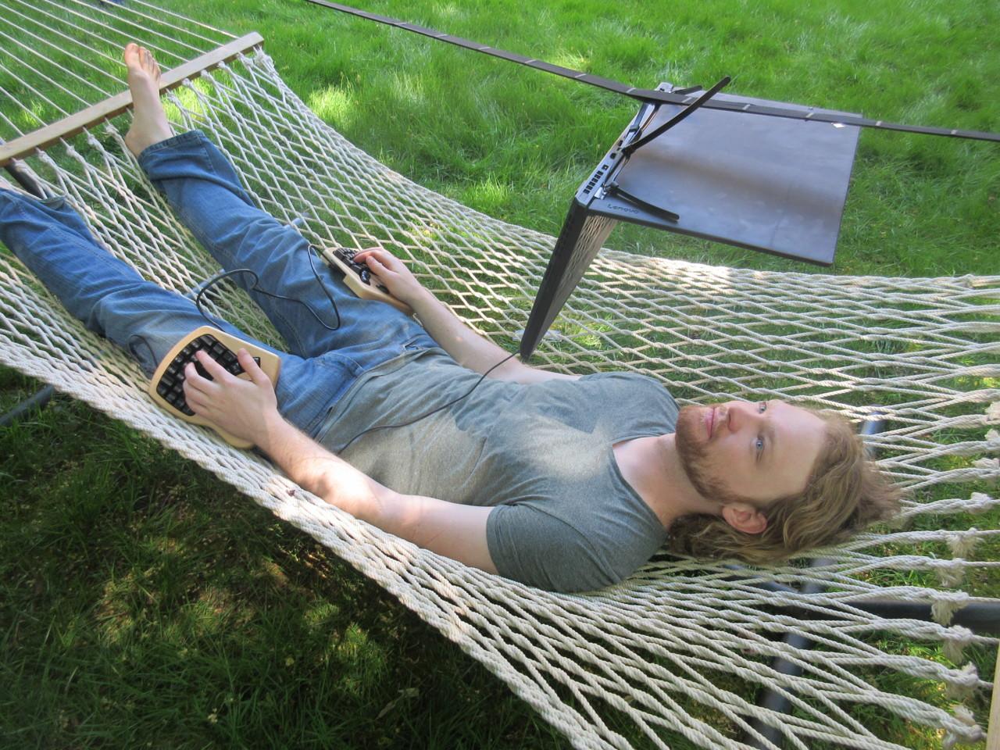

Sure you can sit behind your computer all day, but there are other
ways. I have an adjustable desk at home now, where I can switch between
sitting and standing. But why stop there? Michael Sloan [(@treetopian)](https://twitter.com/treetopian) has a beautiful
exploration of how you can use the computer [lying down](https://mgsloan.com/posts/supine-computing/). 

The post goes into quite some varieties of supine computing, using a
hammock and stringing your laptop up, laying the laptop on your chest
and pillows behind your head. Putting the laptop on your chest but
using inverter glasses so your head stays level. 

The man is a true treasure of other ways of working:
here is [special glasses for outside computing](https://mgsloan.com/posts/polarizer-glasses/), [how to suspend your laptop in many ways](https://mgsloan.com/posts/suspending-laptops/),
[tree based computing](https://mgsloan.com/posts/tree-based-computing/) and finally an 
[overview of deskless working here](https://mgsloan.com/posts/deskless-ergo-wfh/)

Find other posts tagged inspiration [inspiration](https://notes.rmhogervorst.nl/categories/inspiration/)
[hardware](https://notes.rmhogervorst.nl/tags/hardware/)
