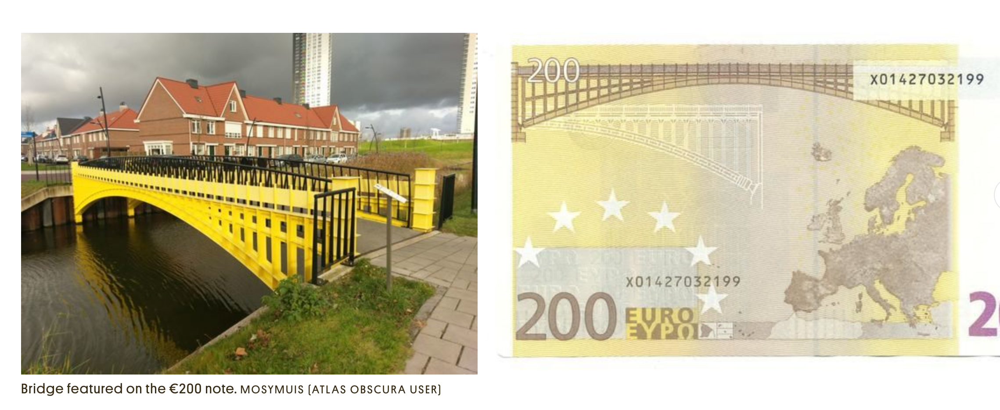

Look, something from my country! A true obscure thingy on the atlasobscura blog: [Euro Banknote Bridges](https://www.atlasobscura.com/places/euro-banknote-bridges)

> The banknote bridges were originally designed in 2002 to appear on the EU currency, dreamed up to represent certain periods in European cultural history. Found on the seven different euro notes—5€, 10€, 20€, 50€, 100€, 200€, and 500€—they illustrate Classical Antiquity, the Roman period, the Gothic period, the Renaissance, Baroque and Rococo, iron and glass architecture, and lastly, contemporary 20th century architecture.
> As there were only seven banknotes and 19 eurozone states, displaying actual existing bridges would favor certain countries over others, so fictional bridges were used. 

> But then, Dutch designer Robin Stam thought it would be fun to make them real. 

Sometimes life inspires art and sometimes art inspires real life. 

Find other posts tagged inspiration [here](https://notes.rmhogervorst.nl/categories/inspiration/)
