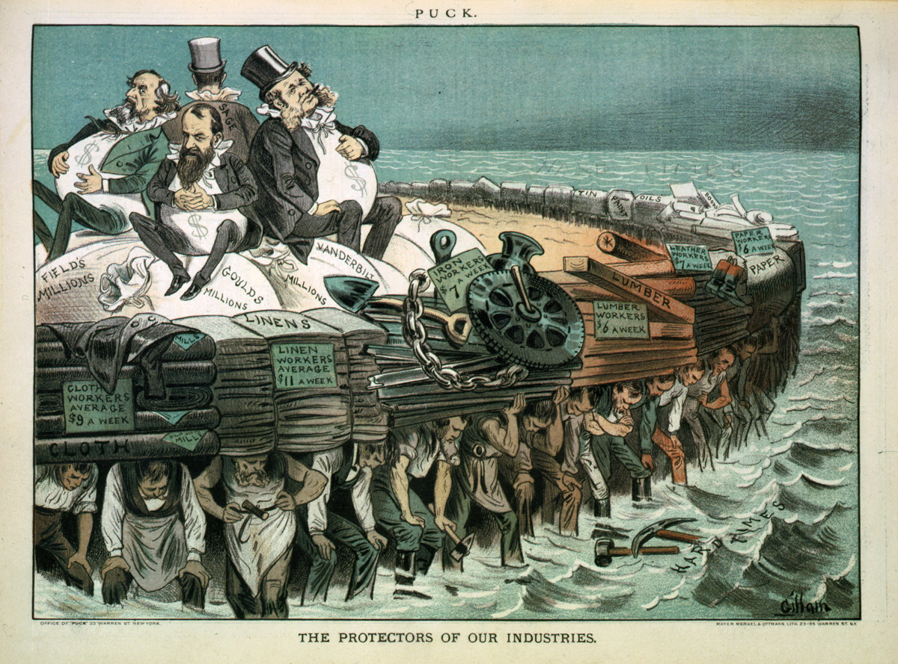

So I read this post (in Dutch):

[Werknemers Miss Etam krijgen geen loon, dreigen faillissement aan te vragen](https://nos.nl/artikel/2351557-werknemers-miss-etam-krijgen-geen-loon-dreigen-faillissement-aan-te-vragen.html)

> Employees 'Miss Etam' are getting no pay, threaten with bankruptcy

This is how I understand the story:

- The smaller clothing stores Miss Etam, Expresso, Claudia Sträter, Steps and Promiss were part of a larger holding company 'FNG Nederland'
- that company went bankrupt in August 2020
- For some reason, someone bought it: Martijn Rozenboom
- Martijn Rozenboom has taken over many companies in the past, almost all of them failed
- The curator knew about the reputation of the man
- The curator decided to still sell it: 

"Natuurlijk houd je rekening met reputaties rond partijen. Maar als curator heb je de wettelijke taak om zoveel mogelijk geld te verzamelen voor zo veel mogelijk schuldeisers. En dit is iemand die een substantieel bedrag heeft geboden en betaald."

> Of course you take the reputation of parties into account. But as a curator we have the lawfull job to collect as much money as possible for as much deptors as possible. And this is someone who bid and payed a substantial amount of money.


And this reminded me of what Cory Docterow calls the Private Equity Playbook:

- [x] buy beloved companies, 
- [?] load them with debt
- [ ] reduce the quality of their products
- [] liquidize their pension funds (not possible in Netherlands, yet)
- [?] collect gigantic "management fees" and walk away
- [x] leaving behind wreckage and sorrow



So here we are again:

The employees of the miss Etam are not getting payed, but after complaining they suddenly are (we will see if they ever get their money btw):

```
NOS.nl:
Tegen RetailNews zegt Rozenboom dat het personeel gewoon betaald wordt.
Vandaag of morgen krijgen ze een deel, 
de rest volgt eind van de maand, aldus de eigenaar.
```

To me this seems obvious, he was never planning on paying them but since these employees are going to sue him, there is talk about pay.


So what is Martijn Rozenboom known for:

in 2014 quote wrote about him as an 'asset stripper', he looks for businesses that are on the brink of failure, pays for the company and it fails after a while again. 

- almost all or all of his buys have gone bankrupt
- he sold the inventory or stole it


It is unknown where he gets his money from, he says its from himself.

So what is going on? Is he putting dept into the companies? Is this a money laundering operation? If all of your bought up companies fail, who is is paying for it? 


### Background quotes from articles

```
<https://www.quotenet.nl/nieuws/a27330527/mislukte-doorstart-op-op-voordeelshop-met-omstreden-bedrijvendokter/>
Quote publiceerde in 2014 een groot portret over deze dealmaker. Meer dan twintig bronnen omschreven hem toen als een begenadigd ‘asset stripper’, die zichzelf verrijkt over de rug van slechtlopende bedrijven. ‘Martijn speurt op internet naar bedrijven die op omvallen staan en introduceert zichzelf daar dan als de beste bedrijvendokter van Nederland. Vervolgens neemt hij het bedrijf voor een habbekrats over en gaat de boel er zwaar lopen tillen’, zei een voormalig zakenpartner van Rozenboom destijds.
```

https://www.bnr.nl/nieuws/ondernemen/10421253/nieuwe-eigenaar-steps-en-miss-etam-lelijk-track-record

```
Asset stripper

Van der Velden sprak tien betrokkenen die bij faillissementen betrokken zijn geweest. Volgens hen biedt Rozenboom zich aan als bedrijvendokter die het bedrijf na het faillissement gaat redden en de werkgelegenheid behoudt, in werkelijkheid verkoopt hij de voorraad, de merkrechten en draait hij zich om en laat anderen met de schulden achter. Zelf zegt Rozenboom dat hij niets verkeerd doet.

Bij geen van de faillissementen waar Rozenboom op af is gekomen is het tot een doorstart gekomen. 
```

https://www.nrc.nl/nieuws/2020/09/18/bedrijvendokter-martijn-rozenboom-belooft-een-medicijn-maar-amputeert-liever-a4012718

```
Verdwenen voorraden

De auto-industrie, een meubelmaker, een aluminiumsmelterij, een bedrijfstrainer. Al lang voordat Rozenboom zich op de overname van winkels stort, bouwt hij een rijk cv op aan activiteiten en bedrijven. De belangrijkste gemene deler? Ze gaan na verloop van tijd failliet of worden opgeheven. Wie er het register van de Kamer van Koophandel op naslaat, vindt tientallen failliete en opgegeven bv’s op Rozenbooms naam. Lang duurden de avonturen nooit, zo blijkt uit onderzoek. 

De praktijk van de boedel overnemen en de zaak alsnog failliet laten gaan, is niet verboden, benadrukken curatoren. Immoreel vinden ze het wel. „Je biedt hoop aan personeel dat al een faillissement heeft doorgemaakt en vervolgens laat je ze nogmaals door zo’n proces gaan”, zegt een curator die met Rozenboom werkte. 

```


*I’m publishing this as part of 100 Days To Offload. You can join in yourself by visiting https://100daystooffload.com, post - 36/100*

*Find other posts tagged  [#100DaysToOffload here](https://notes.rmhogervorst.nl/tags/100DaysToOffload/)*

Picture from <https://en.wikipedia.org/wiki/Robber_baron_(industrialist)#/media/File:The_protectors_of_our_industries.jpg>
