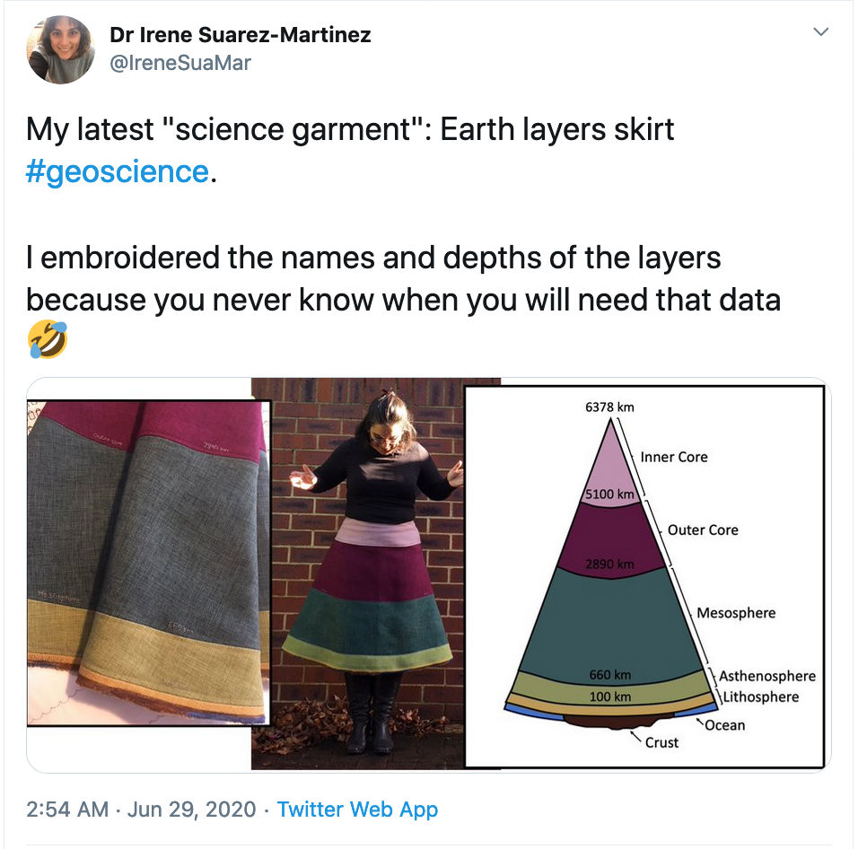

Dr Irene Suarez-Martinez [(@IreneSuaMar)](https://mobile.twitter.com/IreneSuaMar)
shows off a cool skirt with the names and depths of earth layers. 

Nice example of subtle science communication. And a wonderful example
of just geeking out about something and enjoying it!

I think it looks really cool, there is only one flaw:
It has not pockets. The fabric was too thick. 

Find other posts tagged inspiration [here](https://notes.rmhogervorst.nl/categories/inspiration/)
