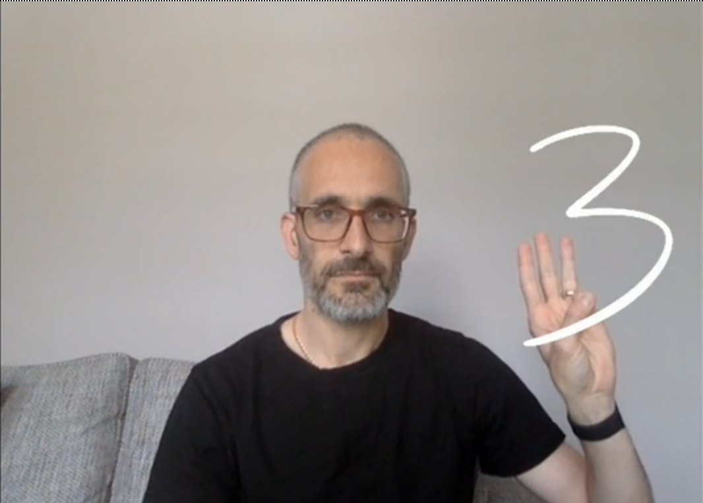
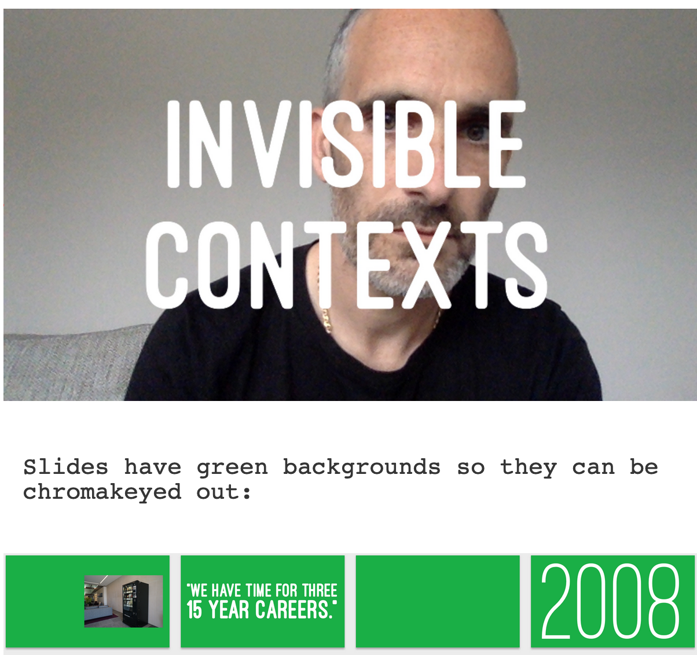

Matt Webb [@genmon](https://twitter.com/genmon) shows us some experiments in
interactive presentations. 

> I became pretty into the idea of having my face and my slides in the frame of a video call.

He's using a virtual webcam: adding data to the video stream of his webcam.

[His blogpost](
http://interconnected.org/home/2020/07/31/more_video_experiments) and
the write up [here](http://interconnected.org/more/2020/07/virtual-webcam/)
go over several creative steps. 

Here is an example of him sketching on a separate screen and displaying that over the video stream.

Or slides with a green background that get chromakeyed out

He also used a [videoprojector for great fun](http://interconnected.org/more/2020/05/projector-vc/)

I cannot give it the love that Matt does, digg into the page and see for yourself!

Find other posts tagged inspiration [here](https://notes.rmhogervorst.nl/categories/inspiration/)
