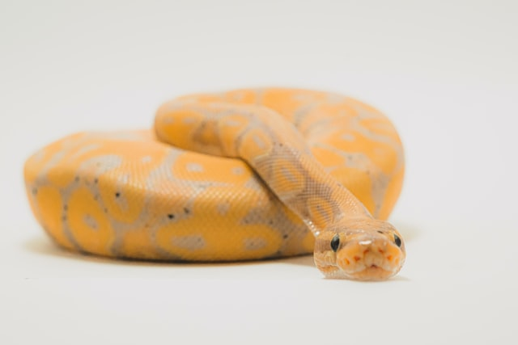

So I was reviewing a package and I my R installation couldn't find the python version I was looking for. But I was sure it was there. I am using pyenv and apperantly I needed to reinstall something.

This is the error you'll see:

```{r}
reticulate::py_config()
Error: Python shared library not found, Python bindings not loaded.
Use reticulate::install_miniconda() if you'd like to install a Miniconda Python environment.
````


My circumstances:

Macbook Catalina 10.15.7
brew installed pyenv. 
I had already set another env variable for reticulate.
It should be able to find the python version, but it couldn't work with it. 

`Sys.setenv(RETICULATE_PYTHON="/Users/YOURNAME/.pyenv/versions/NAMEOFVIRTUALENV/bin/python")`


## What is going on?
Python does not by default create a shared library. I am a bit
vague on the details but it has something to do with the compilation options of c code underneath python. It seems
if you do not set this flag the cython is compiled in a different way and cannot be used by a different program (like reticulate). 


Install your python version with pyenv in the following way:
(in this case I'm using pyenv and with python 3.7.4 )

```{python}
env PYTHON_CONFIGURE_OPTS="--enable-shared" pyenv install 3.7.4
```
This sets an environmental variable called PYTHON_CONFIGURE_OPTS and than installs this python version (Again if it was already there)

Now a call to py_config `reticulate::py_config()` returns information about the version of python, and numpy is displayed.


<span>Photo by <a href="https://unsplash.com/@timothycdykes?utm_source=unsplash&amp;utm_medium=referral&amp;utm_content=creditCopyText">Timothy Dykes</a> on <a href="https://unsplash.com/s/photos/snake?utm_source=unsplash&amp;utm_medium=referral&amp;utm_content=creditCopyText">Unsplash</a></span>
