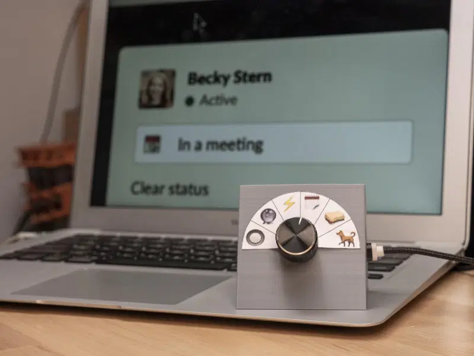

Over at hackaday.com 2 months back this beautiful elegant status switching
board was described:

Becky Stern describes in the video how she created this tool, it 
is supersimple in design but I think the hardware component makes it so
much easier to set your status in slack/teams/whatever tool you use.

The complete [hackaday post is here](https://hackaday.com/2020/09/02/dont-slack-off-on-updating-your-status/) 
This video also made me think about something I can longer find, but
in the early 2000s someone did a study to enable collaboration and it worked
like this (according to my recollection, which is not all to reliable):

- Every employee had a zen like garden on their desk.
- You can move items in the garden to represent you are in one of 4 states: free to chat, open for collaboration, away or concentrating
- You move the item into one of the 4 corners to represent your state
- There is a camera above the garden that checks in what corner the item is
- and that status is then also communicated in an application that is visible for everyone (like a status emoji or something)

I believe they found that because it is a nice physical object people were more likely to use it. And because the signal was a reliable indicator, people were not interupted during their concentration time, and were interrupted when they wanted it

So I guess physical tokens are really useful!

Find other posts tagged inspiration [here](https://notes.rmhogervorst.nl/tags/inspiration/)
