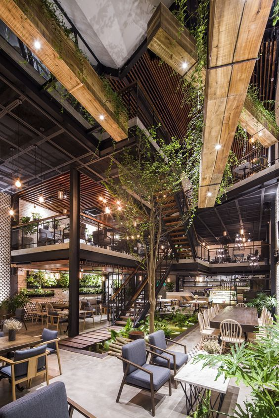

I found a beautiful overview of urban garden pictures on slate.host.
I really really love these images of urban environments filled with plants.

<https://slate.host/gndclouds/urban-gardens>

The technology of slate.host is fascinating and might be something I come back to, it is build on the interplanetary file system (IPFS), textile and filecoin although I don't actually know how it all fits together.

Find other posts tagged inspiration [here](https://notes.rmhogervorst.nl/tags/inspiration/)
