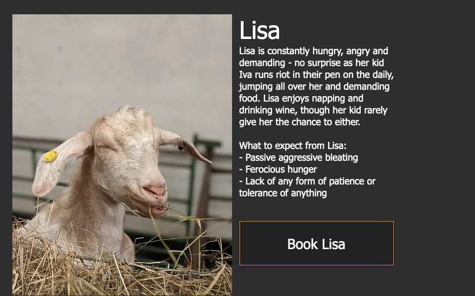
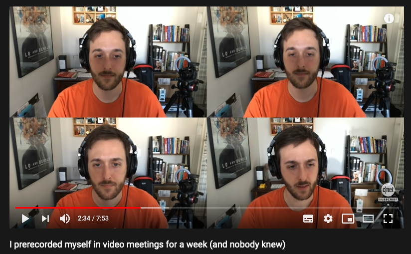

A collection of things to make your videocalls better:

- a goat
- hand gestures
- prerecording 

## The goat
First the goat: a farm in Lancashire, England gives you the ability
to add a goat to your meeting. You give them the adres, they point a webcam
on the goat of your choice and it will join the meeting for 5 minutes.

> The goats are savvy in Zoom, Microsoft teams, Webex, Blue Jeans, Skype, Google Hangouts, Jitsi, Go To Meeting and Ring Central.

## Gestures to interact with your video

[Cameron Hunter (@cameronhunter) uses the snap camera to add cartoon style exclamations to his videocalls](https://twitter.com/cameronhunter/status/1305667539922550784). This tool detects moves you make and creates a composite of the webcam and animations on top of it. 

## Pre recording

Jesse Orrall over at CNET had to attent a lot of meetings over zoom
and he [created a set of videos to auto respond to those](https://www.cnet.com/how-to/how-i-pre-recorded-myself-in-video-meetings-for-a-week/). Of course it took him even more work than attending the meetings, and he had to press buttons to respond correctly but the idea is marvelous.

Also the CNET website is a steamy piece of garbage to interact with, so if you can stand it, here is the [youtube version of the video](https://www.youtube.com/watch?v=b-VCzLiyFxc).

So I hope you find these things inspirational, they were for me!

Find other posts tagged inspiration [here](https://notes.rmhogervorst.nl/categories/inspiration/)
