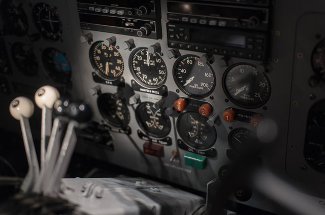

When I was in social sciences research we always always had to get permission
from the ethical committee _(in the USA they use an Institutional Review Board; IRB)_
before we did anything. 

This is partly because of the insane and unethical experiments
in the 1950s:  like the obedience experience from Milgram,  the Stanford prison 
experiment and in the medical world the Tuskegee Syphilis Study. 

These reviews were sometimes a pain in the backside, but generally a really good thing. These 
oversight committees force you to think about your experiment, the invasion on
privacy, or actual hurt you cause for your subjects. This is good! There needs
to be a balance between how much you can learn and how much this costs your
subjects. Even the questionnaires you use are checked. All of this intro just 
to say:    

One of the most important
questions you should ask yourself is: 

**what am I going to use this information for?**

Data minimalism is something I advocate for, but I also fall into the trap of
collecting without thinking through what I 'm going to use the collected
data for. And everytime I do something like that, the results are mediocre.

I collected daily coffee intakes for a year. Never really used it. I guess the
most you could say about my coffee intake, is that I drink 3 to 4 cups of coffee
between 730 and 1300 hour (I already knew that before I started).

I collected  screen activations for a very long time. In 2019 I wrote one blog post about
how [I set it up using tasker](https://blog.rmhogervorst.nl/blog/2019/01/28/logging-my-phone-use-with-tasker/) and [one post with some analyses and graphs](https://blog.rmhogervorst.nl/blog/2019/01/28/graphing-my-daily-phone-use/)
I never looked at my data again but kept collecting it. I turned it off 
~ 2 years (and 10469 observations) later, because I don't use it. I had ideas of how I would use it to 
send graphs of last week to myself, but I never did. I never set up the tooling
to create the graphs for instance.

I created a tool that at several random moments during the day asks me if I have
pain in my stomach (I wanted to find out if there is a pattern). but I never set
up the analysis plan and so it was just collecting without a goal and ultimately
useless. 

Sometimes it works out though, I kept track of what I eat during a few
days to see how much protein I ate, because I was weightlifting. After a few 
days of regular meals I realized it was a bit low and added some foods to my 
diet to increase the protein levels. Now I don't collect it anymore, it served
its purpose. 

So lessons learned: set up processing pipeline and goals directly. Couple your
tracking to a goal.  

Photo by <a href="https://unsplash.com/@valeon">Mitchel Boot</a> on <a href="https://unsplash.com/s/photos/metrics">Unsplash</a>
  
