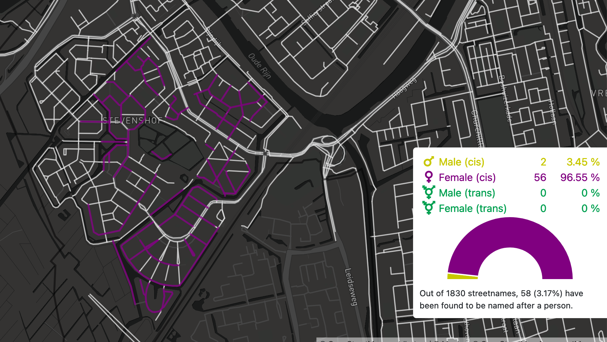

This weekend I played around on the intersection of open streetmap (OSM) and wikidata. Two awesome projects with open data! The project is called [equalstreetnames](https://equalstreetnames.be/) 

As the project says:

> The names of public spaces (streets, avenues, squares and others) define the identity of a city and how citizens interact with it. Most cities suffer from a major inequality between male and female street names and we want to help fix this. 

The project retrieves all the streets in a city from open streetmap (OSM) and
checks to see if the streets have a wikidata identifyer for etymology. 
For all these `name:etymology:wikidata` tags it retrieves the gender. 
I thought this was a very cool project and so I created one for my city: Leiden.

Everything in open streetmap can be tagged with values.
So for instance <https://www.openstreetmap.org/way/39502746> refers to a bicycle 
path with a name tag `Maartje Offerspad` and a name:etymology:wikidata-tag `Q4822730`. The equalstreetnames project goes into wikidata and retrieves the entity Q4822730, which refers to ["Maartje Offers" a Dutch Opera singer](https://www.wikidata.org/wiki/Q4822730). It than finds the gender of that person (property p21) and stores it.

The equalstreetnames project goes through all the streets and determines an overall percentage of male (cis), female (cis) male (trans), female (trans) origins of streetnames. Finally it creates a slick map with colors for the 4 groups. 

When I started the project I was very disappointed, there were only 4 streets
labelled with `name:etymology:wikidata` tags. But the cool thing about this 
project is that you can do a lot of the work yourself! Go through the streets
on open streetmap and tag the streets named after people. 

I've spend a few hours doing just that and it is very satisfying!

And so, I proudly present <https://leiden.equalstreetnames.eu/en/index.html>

The equalstreetnames project has set up a github-actionsinfrastructure that 
downloads all the names and generates the data to refresh the map every week.

This was a small project with an excellent README, that was easy to get up
and running in no time. I super enjoyed setting this project up.
