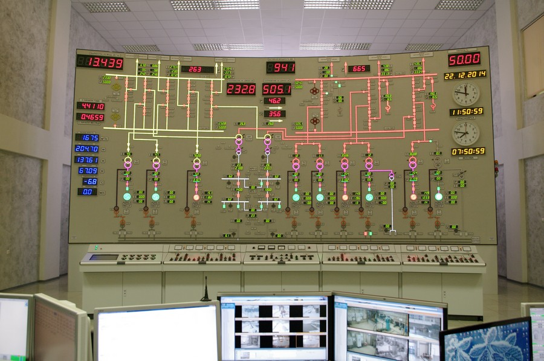
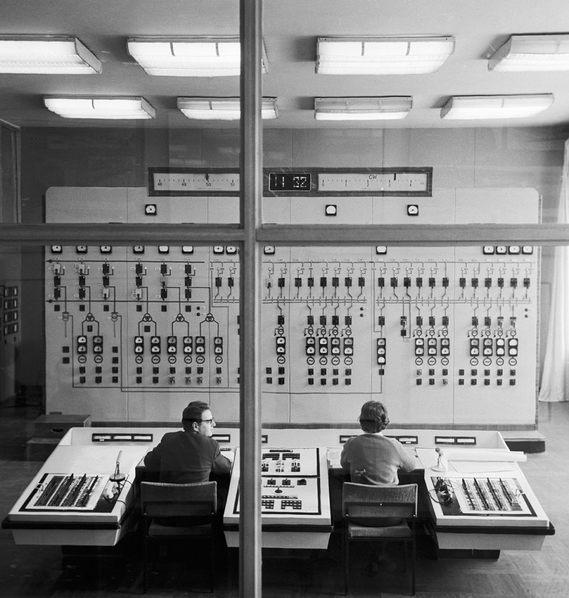

[**Button it.**](http://blog.presentandcorrect.com/27986-2) is a collection of Soviet control rooms. Power stations, control towers etc. Posted mainly for aesthetic reasons.

Can be found at <http://blog.presentandcorrect.com/27986-2>

Crossposted from the [amazing sentiers newsletter](https://sentiers.media/map-room-1950s+computers-enable-fantasies+imagination-infrastructure-what-we-mean-no-250/) edition 250.

Find other posts tagged inspiration [here](https://notes.rmhogervorst.nl/tags/inspiration/)
