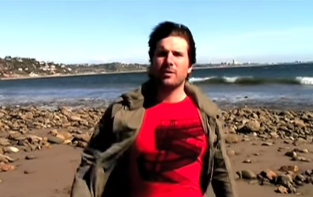
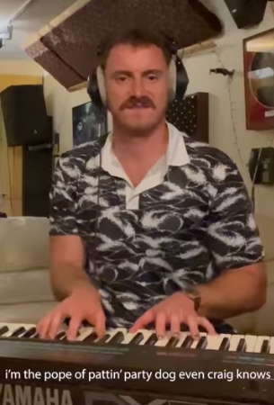

<!--
tags: 100DaysToOffload

Once you have published an article, don’t forget to post a link on your social media with the hashtag #100DaysToOffload

 -->
What is it about these artists that make me appreciate their work so much? I don't know. I just wanted to share them, in the hope you get as much joy as I receive. 
I especially enjoy music that sounds amazing and only when you listen to the lyrics do you realize that it is silly. 

And ehm, yeah this is all not really safe for work if they listen to the lyrics.

## Tenacious D
Need no introduction really. Kyle Gass and Jack Black are brilliant. 
Of course you know [Tribute](https://youtu.be/_lK4cX5xGiQ)
and maybe you know [The Metal](https://youtu.be/QOUcIsvymOY) _if you've played Guitar Hero 3_. 

But their recent work like [Woman Time](https://youtu.be/cPYvOFsBhmQ) and (_god it's been 10 years!) [Low hanging fruit](https://youtu.be/JXVObHt94T8) are awesome too.

## Jon Lajoia
There was a time 15 years ago where I was completely hooked on [Jon Lajoie (youtube channel)](https://www.youtube.com/@jonlajoie  "youtube channel"). ([professional website](https://www.jonlajoie.com/)) He's started making new music under the name **Wolfie's just Fine** which is great because that man is incredibly talented. 

One of the best ones is this video and music in the style of Coldplay in their early period. 

[Alone in the universe](https://www.youtube.com/watch?v=ShTm8MnUAjo)

And this commentary on pop videos. [Pop Song](https://www.youtube.com/watch?v=ijr4rwb2WbE)

## Tom Cardy
I discovered Tom Cardy recently. He's a salty Australian artist and I love his energy. He seems to record all his songs and videos in the same studio. All of these songs are straight up pop-bangers!

- [Tom Cardy youtube channel](https://www.youtube.com/@tomcardy1)
- [Tom Cardy Bandcamp](https://tomcardy.bandcamp.com/)

Funniest right now
- [H.Y.C.Y.BH? ](https://youtu.be/--9kqhzQ-8Q)
- [Your Love is Not Enough (I'd like Some Cool Sh*t Too)](https://youtu.be/ZqC507FpRDg)
- [Party Dog ft. Ernie thee Corgi](https://youtu.be/wVYPLP9NSg4)

## Jazz Emu
And finally, an English artist with a bucket full of pop bangers. 
- [Jazz Emu youtube channel](https://www.youtube.com/@JazzEmu)
- [Jazz Emu bandcamp](https://jazzemu.bandcamp.com)

Hardest pop bangers:
- [Still Waiting](https://www.youtube.com/watch?v=_ws0QtAiiXQ)
- [Allergy](https://youtu.be/uiH9GTkcWNI)

*I’m publishing this as part of 100 Days To Offload. You can join in yourself by visiting https://100daystooffload.com, post - 1/100 - 2023*

*Find other posts tagged  [#100DaysToOffload here](https://notes.rmhogervorst.nl/tags/100DaysToOffload/)*
