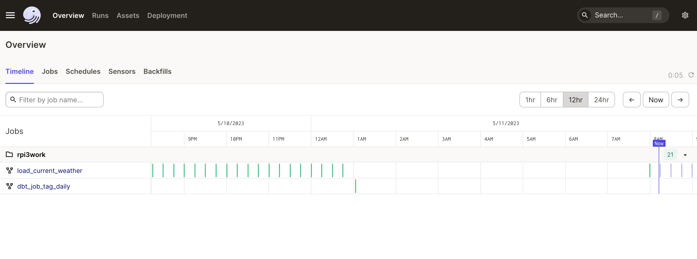
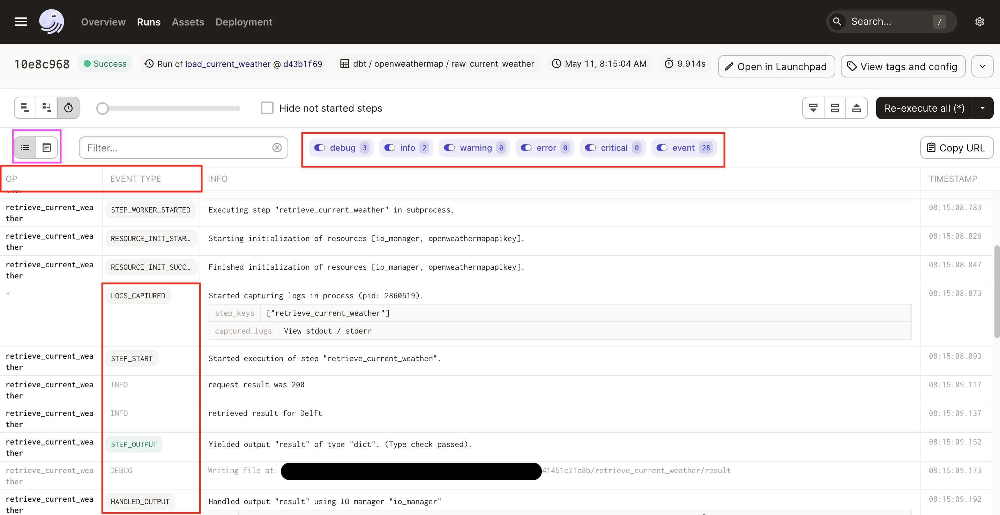

<!--
tags: 100DaysToOffload

Once you have published an article, don’t forget to post a link on your social media with the hashtag #100DaysToOffload

 -->
 
For one of our clients we use dagster and want to copy the logs somewhere else.

## Moving logs from a container/process to different places
There are several ways to do that; if you use kubernetes you can add a deamonset to your namespace (that slurps out all the stdout and stderr that you see in containers).
Or you can add a sidecar configuration: Your main pod has a sidepod (fluentd for example) that reads logs from a shared disk and sends it to other places.
Or you can send directly from a process by adding a logging handler.

## dagster
Dagster has an amazing gui that shows you the current runs, status and allows you 
to kick off manual runs. 

 
If you look at the run information screen you see at what level a log is, (you 
can togggle which ones to see on the top) the `op` (operation) that emitted the log
the message itself and the time. 

Dagster is a modular product and you can turn on and off or configure things as
you wish. Locally you might write to sqlite and disk, but in production you might want
to write to a postgres database and S3.

You configure a part of the system with a yaml file. the [dagster.yaml file](https://docs.dagster.io/deployment/dagster-instance).

We then have config for
- python_logs
- event_log_storage
- compute_logs

We thought we could change where the logs (that you see on the screen) went by
changing the compute log settings. But that is not true.

Compute logs are the outputs (stderr and stdout of ops) NOT the structured logs
that you see on the screen (although they are sometimes the same).
If you want to capture the logs, you need to set the [python logger in dagster](https://docs.dagster.io/concepts/logging/python-logging#configuring-python-log-handlers-)

By setting up different handlers and formatters for the dagster logs under python_logs you can change the way these logs are saved. 

*I’m publishing this as part of 100 Days To Offload. You can join in yourself by visiting https://100daystooffload.com, post - 4/100 2023*

*Find other posts tagged  [#100DaysToOffload here](https://notes.rmhogervorst.nl/tags/100DaysToOffload/)*
